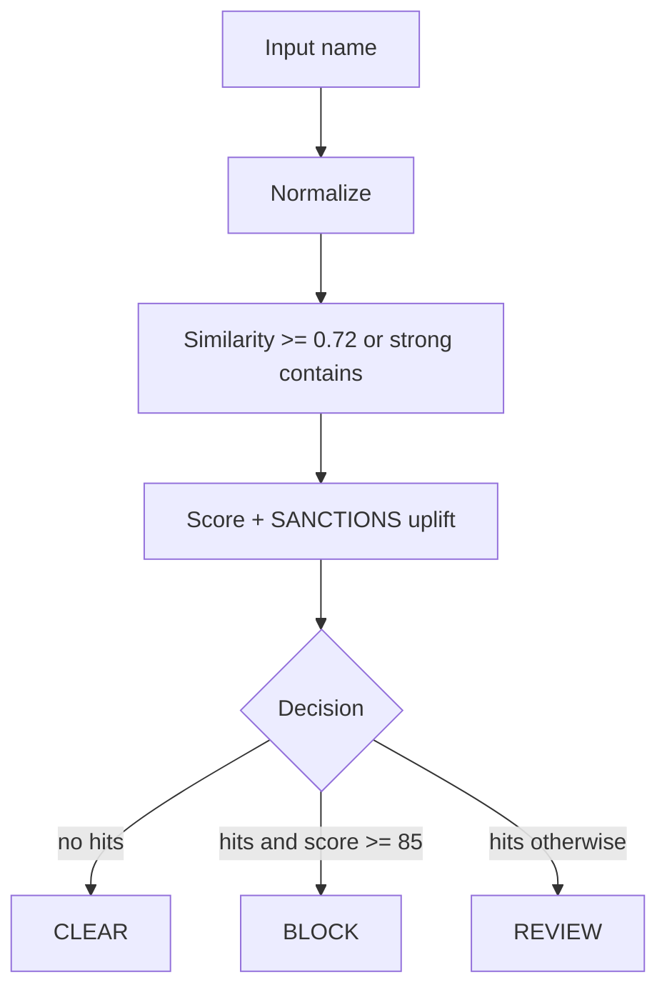

# AML Sanctions Screener

Educational AML name-screening service. Screens a customer / counterparty name against a small in-memory watchlist using normalized compare and **Levenshtein** fuzzy matching, then returns `CLEAR` / `REVIEW` / `BLOCK`.

Demo watchlist entries are fictional. Not a production sanctions feed.

## Architecture



## Decision rules

- Any watchlist hit is at least `REVIEW` (never `CLEAR` with hits).
- Substring contains only applies when the shorter side has length ≥ 5 (reduces `"an"` / `"john"` style false positives).
- `SANCTIONS` hits get a small score uplift versus `PEP`.

## API

| Method | Path | Body |
|--------|------|------|
| `POST` | `/api/aml/screen` | `{ "name": "..." }` |
| `GET` | `/api/aml/health` | — |

### Example response

```json
{
  "query": "Ivan Petrov",
  "decision": "BLOCK",
  "riskScore": 100,
  "hits": [
    {
      "watchlistId": "WL-1",
      "matchedName": "Ivan Petrov",
      "listType": "SANCTIONS",
      "distance": 0,
      "score": 1.0
    }
  ]
}
```

## Quick start

```bash
./mvnw test
./mvnw spring-boot:run
```

HTTP: `http://localhost:8085`

## License

[MIT](LICENSE)
