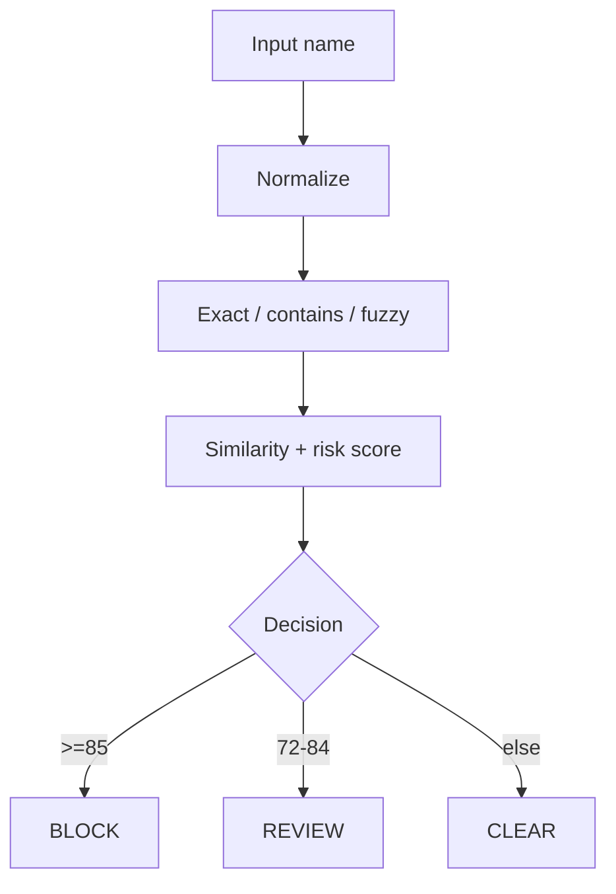

# AML Sanctions Screener

Educational AML name-screening service. Screens a customer / counterparty name against a small in-memory watchlist using normalized string compare and **Levenshtein** fuzzy matching, then returns `CLEAR` / `REVIEW` / `BLOCK`.

Demo watchlist entries are fictional. Not a production sanctions feed.

## Architecture



## Quick start

```bash
./mvnw test
./mvnw spring-boot:run
```

HTTP: `http://localhost:8085`

```bash
curl -s -X POST http://localhost:8085/api/aml/screen \
  -H "Content-Type: application/json" \
  -d "{\"name\":\"Ivan Petrov\"}"
```

## License

[MIT](LICENSE)

## Notes

Demo watchlist entries are fictional and not a live sanctions feed.

